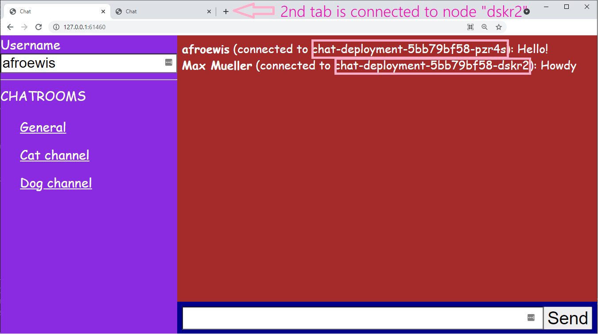

# go-chat

Proof Of Concept: Horizontally scalable, websocket-based chat application. Uses redis pub/sub to communicate between server nodes.

## Helpful commands
Build docker image: `docker build -t go-chat .`

Show logs: `kubectl logs -f -l app=chat --all-containers`

Run app in browser: `minikube service chat-service`

## Running without Kubernetes & Redis
1. Set `Debug` in `main.go:11` to `true`
2. Run the project: `go run *.go`